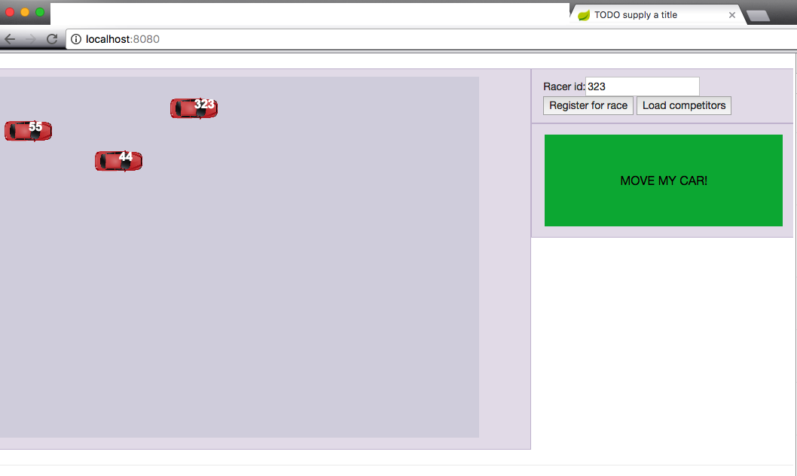

## Escuela Colombiana de Ingeniería
### Arquitecturas de Software
### Parcial Segundo Tercio

Click race es un juego de carreras multijugador, en el que cada competidor hace desplazar su automovil (identificado con un número elegido por la persona) haciendo clic en un botón. En este juego, gana quien llegue primero a la meta, que en este caso es el extremo derecho del área de la pantalla. Por ahora sólo se manejará una única carrera (identificada cone l número 25), razón por la cual todas las peticiones al Backend del cliente tienen 'quemado' este número: /races/25/...):

La versión actual de la aplicación funciona de la siguiente manera:

1. Cada concursante abre el cliente de la aplicación (http://localhost:8080), y se registra con un número elegido por él (el número no debe estar previamente registrado).
2. En cualquier momento, puede oprimir 'Load competitors', para competir con quienes se hayan registrado hasta ese momento (de nuevo, por defecto sólo se buscarán los competidores en la carrera #25).
3. A partir de este momento, el jugador podrá no sólo desplazarse en la pista, sino ver el desplazamiento de los competidores que cargó. Sin embargo, no se está garantizando que todos los competidores hayan cargado el mismo número de contricantes (ya que cada cual decide en qué momento hace dicha operación), y no queda definido quien es el ganador.

La siguiente, es una vista dinámica -diagrama de actividades- de la versión actual de la solución, ilustrando la manera como se sincronizan los estados de los N clientes:

### PARCIAL

1. (50%) Ajuste la aplicación:

	A. El botón 'MOVE MY CAR!' debe estar deshabilitado al iniciar el juego, y se debe remover el botón 'Load competitors'. En cuanto se registren los primeros 5 competidores -NI MÁS NI MENOS- a través del API REST, los clientes automáticamente cargarán sus competidores y habilitarán el botón de juego.
	

	B. El API REST del Backend ahora debe tener el recurso __/races/{racenum}/winner__ el cual corresponda al competidor ganador. Por lo tanto, se considerará ganador el primero que se registre a sí mismo en dicho recurso (los intentos posteriores de registro deberían generar un error), lo cual debe darse cuando dicho cliente cruce la pantalla (coordenada en X mayor o igual a 640). Una vez se tenga definido al ganador, en todos los clientes se debe mostrar automáticamente su nombre. 

2. (10%) En el archivo RESPUESTAS.txt, describa clara pero brevemente las posibles condiciones de carrera que se podrían dar para lo anterior. Indique la región crítica, las posibles inconsistencias que ésta generaría, y cómo las evita en su solución.

3. (20%) Realice la vista dinámica (diagrama de actividades) de su solución en la hoja suministrada. 

## Entrega

Subir el código fuente actualizado con los puntos del parcial, en el espacio asignado dentro de la plataforma Campus.